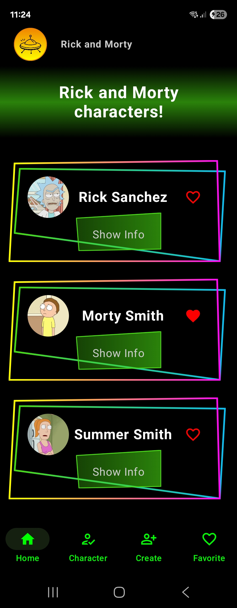
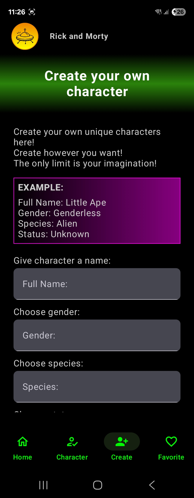
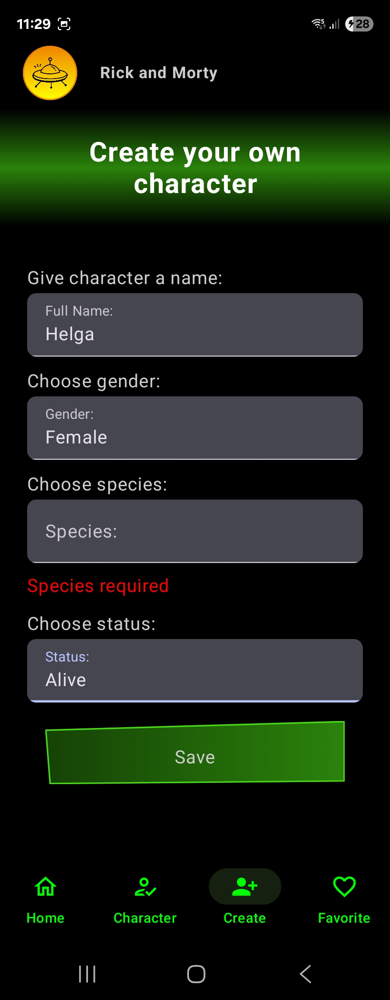
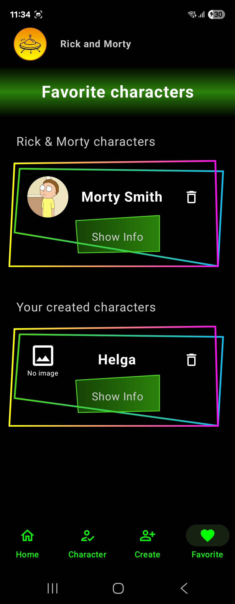

# Rick and Morty App

A simple Android app for **Rick and Morty** fans 🎉  
The app lets you browse characters from the Rick and Morty series, create your own characters, and manage favorites.

---

## ✨ Features
- 📺 Browse characters from the Rick and Morty API
- ⭐ Add and remove favorite characters
- ✍️ Create and delete custom characters
- 🔄 When a character is deleted, it is automatically removed from the favorites list

---

## 🛠️ Built with
- **Kotlin** – app logic
- **Room Database** – local storage for characters and favorites
- **MVVM architecture** – clean separation between UI, data, and logic

---

## 📸 Screenshots

### 🏠 Home

A simple home page with sci-fi-inspired styling that displays Rick and Morty characters.

### 👤 Character

This page shows a collection of the user's created characters.  
Users can add them to the favorites list by clicking the heart icon.  
They can also remove them from favorites by unmarking the heart icon.  
If a user deletes a character here, it will automatically disappear from the favorites list.

### ✍️ Create

Users can create their own characters by filling out the form with information.  
An example is shown, and if a required field is left empty, the app will notify the user.

### ⭐ Favorites

The favorites page shows a list of both Rick and Morty characters and user-created characters that have been marked as favorites.  
Users can also remove characters from this list by unmarking the heart icon. 
Once unmarked, the character will be removed from the 'Favorites' list.