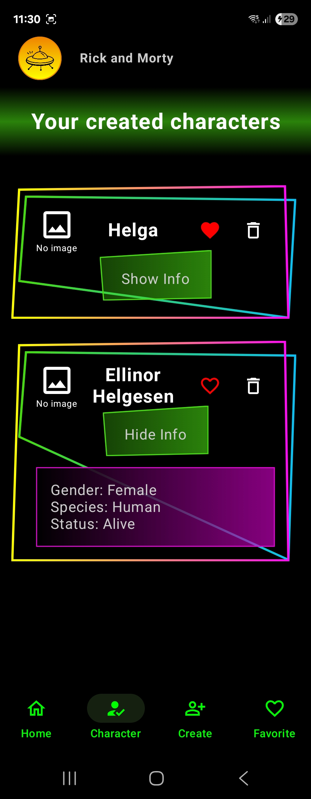

# Rick & Morty App

A simple Android app for **Rick & Morty** fans 🎉 
The app lets you browse characters from the Rick & Morty series, create your own characters, and manage favorites.

---

## ✨ Features
- 📺 Browse characters from the Rick & Morty API
- ⭐ Add and remove favorite characters
- ✍️ Create and delete custom characters
- 🔄 When a character is deleted, it is automatically removed from the favorites list

---

## 🛠️ Built with
- **Kotlin** – app logic
- **Room Database** – local storage for characters and favorites
- **MVVM architecture** – clean separation between UI, data, and logic

---

## 📸 Screenshots

### 🏠 Home

### 👤 Character

### ✍️ Create
 

### ⭐ Favorites
